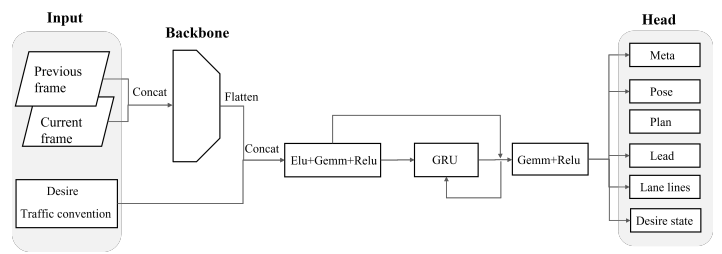
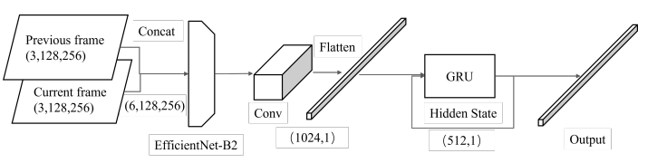

Documentation of the whole project: (report)[./TFG.pdf]

# Methodology Overview

This guide serves as a comprehensive, hands-on methodology for generating adversarial examples, providing users with both theoretical insights and practical implementations. It covers attacks on a wide range of machine learning systems, from image classification models to complex autonomous driving systems like **Openpilot**.

The guide is designed for users with a basic understanding of machine learning and neural networks, and it provides clear, step-by-step instructions for implementing adversarial attacks in various environments. Throughout the guide, users will explore both **white-box** and **black-box** adversarial strategies, applying them to different machine learning models, including:

- **Image classification models** such as custom-built neural networks and fine-tuned models like **ResNet-50**.
- **Autonomous driving systems** like Openpilot, focusing on the internal workings of its modules and deep learning models, such as the **Supercombo** model.

In addition to generating adversarial examples, this guide demonstrates how to simulate attacks in real-world scenarios using **CARLA**, a high-fidelity driving simulator. CARLA will be used to test adversarial attacks on autonomous vehicles in controlled environments, enabling users to observe the practical impact of these examples on complex systems.

By the end of this guide, users will have a solid understanding of:
- The nature and creation of adversarial examples.
- How to implement white-box and black-box attacks on various machine learning models.
- Security assessment of systems like Openpilot.
- How to use **CARLA** for testing adversarial examples in simulated autonomous driving scenarios.

The methodology presented in this guide offers a structured approach for both beginners and intermediate users who wish to delve into the field of **Adversarial Machine Learning** and its application in critical real-world systems like image recognition and autonomous driving.

# Table of Contents
- [Directory Breakdown](#directory-breakdown)
- [Introduction](#introduction)
  - [What are Machine Learning Models?](#what-are-machine-learning-models)
  - [What is an Adversarial Example?](#What-is-an-Adversarial-Example)
  - [What is Adversarial Machine Learning?](#What-is-Adversarial-Machine-Learning)
  - [White-box and Black-box Approaches](#White-box-and-Black-box-Approaches)
- [Openpilot](#openpilot)
  - [What is the Openpilot Autonomous Driving System?](#what-is-the-openpilot-autonomous-driving-system)
  - [Openpilot Version History](#openpilot-version-history)
  - [Accidents Related to Openpilot](#accidents-related-to-openpilot)
  - [Openpilot Internals](#openpilot-internals)
- [Running Openpilot in CARLA simulator](#running-openpilot-in-carla-simulator)
- [Adversarial Machine Learning](#adversarial-machine-learning)
  - [White-Box Attacks](#white-box-attacks)
  - [Black-Box Attacks](#black-box-attacks)
- [Conclusions](#conclusions)

# Directory Breakdown
This guide is separated in some folders:
- [attacks/](attacks): The `attacks/` folder contains python implementations of the adversarial attacks described during the methodology.
- [docs/](docs): The `docs/` folder contains other specific documentations in addition to the general methodology, such as: Carlini&Wagner, Openpilot White-box Adversarial Attack, etc.
- [images/](images): The `images/` folder contains images used during the docs for additional resources and making explanations more understandable.

# Introduction

## What are Machine Learning Models?
**Machine Learning (ML)** models are algorithms that learn patterns from data to make predictions or decisions based on new, unseen data. These models range from simple linear regressions to complex DNNs, which are capable of recognizing intricate patterns in large datasets. DNNs have become the cornerstone of modern artificial intelligence, powering systems in fields like image classification, speech recognition, and autonomous driving.

## What is an Adversarial Example?
An [**Adversarial Example**](https://www.tensorflow.org/tutorials/generative/adversarial_fgsm) **(AE)** is a carefully crafted input designed to deceive deep neural network (DNN)-based models into making incorrect predictions. These examples are typically created by adding small, often imperceptible, perturbations to the original input data, such as images, which causes the model to misclassify or predict erroneously with high confidence. While adversarial perturbations may be subtle and unnoticeable to humans, they can significantly disrupt machine learning models, highlighting vulnerabilities that are especially concerning in safety-critical applications like autonomous driving and facial recognition.


### [Example](https://arxiv.org/pdf/1801.02780):
Imagine an image classification model that identifies a benign logo. By adding a minimal adversarial perturbation to the image, the model might mistakenly classify it as a stop sign with a confidence of 1.0, posing serious safety risks in an autonomous driving context. This type of vulnerability exemplifies the critical importance of understanding and mitigating adversarial examples.

## What is Adversarial Machine Learning?
**Adversarial Machine Learning (AML)** is a field that investigates how adversarial examples exploit the weaknesses of machine learning models. AML explores the methods attackers use to generate adversarial examples and focuses on crafting defenses to make models more robust. Attacks in this domain are typically divided into two categories: **white-box** and **black-box** attacks.

AML is of great importance in areas where security and safety are critical, such as autonomous vehicles.

## White-box and Black-box Approaches
This guide will introduce and implement both **white-box** and **black-box** adversarial example attacks:
- **White-box attacks** assume the attacker has complete knowledge of the model, including its structure, parameters, and training data. An example of this is the **Carlini & Wagner (CW) attack**, which is highly effective in finding adversarial examples by minimizing the perturbation needed to mislead the model.
- **Black-box attacks**, on the other hand, assume the attacker has no knowledge of the model. These attacks rely on probing the model through queries and observing the outputs to infer its vulnerabilities. Techniques like **Evolution Strategies (ES)** and **Gaussian Mutation** are commonly employed in black-box scenarios.

Both approaches will be explored in this project, targeting models trained from scratch and pre-trained models like **ResNet-50** for image classification, as well as the **Openpilot** autonomous driving system. Through a series of practical examples and step-by-step instructions, users will gain hands-on experience implementing these adversarial attack strategies.

# Openpilot
## What is the Openpilot Autonomous Driving System?
[**Openpilot**](https://comma.ai/openpilot) is an [open-source](https://github.com/commaai/openpilot), advanced driver assistance system (ADAS) developed by Comma.ai. It provides autonomous driving capabilities such as **adaptive cruise control (ACC)**, **lane keeping assistance (LKAS)**, and **forward collision warnings (FCW)**. Openpilot uses a combination of sensors (including cameras, radars, and GNSS) along with deep learning models to interpret the driving environment and make real-time decisions. It has been designed to enhance the driving experience, offering partial autonomy that assists drivers in various tasks.

At the heart of Openpilot is a **deep neural network (DNN)**, specifically the [**Supercombo model**](https://github.com/commaai/openpilot/tree/master/selfdrive/modeld/models), which processes sensor inputs and predicts driving actions such as lane positioning, speed adjustments, and obstacle detection. The system integrates with supported vehicles' onboard sensors and actuators to control acceleration, braking, and steering autonomously, reducing the driver's workload and improving safety.

Openpilot is not a fully autonomous system; it is classified as **Level 2 autonomy**, meaning that while the system can manage some driving tasks, the driver is required to remain attentive and ready to take control at any time.

## Openpilot Version History

Since its initial release, Openpilot has evolved some [versions](https://github.com/commaai/openpilot/blob/master/RELEASES.md), each improving on the system's robustness, functionality, and ease of use. Below is a brief overview of the key Openpilot versions and their main improvements:

### Version 0.1.x (2016-11-29)
- Initial release of Openpilot.
- **Adaptive Cruise Control (ACC)** and **Lane Keep Assist (LKA)** functionalities were introduced.
- Supported vehicles: **Acura ILX 2016** with AcuraWatch Plus and **Honda Civic 2016 Touring Edition**.

### Version 0.2.x (2016-12-12)
- Major refactor of the **controls** and **vision** modules.
- Added **car and radar abstraction layers** for broader compatibility.
- Docker container introduced for testing on a PC.
- **Plant model** for testing maneuvers was shipped}.

### Version 0.3.x (2017-05-12)
- Added **CarParams** struct to improve abstraction layers.
- New model trained with more crowdsourced data for improved lane tracking.
- Initial **GPS** and **navigation support**.

### Version 0.4.x (2018-01-18)
- Significant updates to **UI aesthetics** and **autofocus**.
- Added alpha support for **2017 Toyota Corolla** and **2017 Lexus RX Hybrid**.
- Focus on improving lane tracking when only one lane line is detected.

### Version 0.5.x (2018-07-11)
- Introduced **Driver Monitoring (beta)** feature.
- Major efficiency improvements to **vision**, **logger**, and **UI** modules.
- New side-bar with stats, making UI more intuitive.

### Version 0.6.x (2019-07-01)
- **New driving model**: increased the temporal context tenfold, making lane-keeping more reliable.
- Openpilot now uses only ~65% of CPU resources, improving system stability and efficiency.

### Version 0.7.x (2019-12-13)
- Introduced **Lane Departure Warning (LDW)** for all supported vehicles.
- **Supercombo model**: Combined calibration and driving models for better estimates of lead vehicles.

### Version 0.8.x (2020-11-30)
- Fully 3D driving model introduced, significantly improving cut-in detection.
- **UI** now draws 2 road edges, 4 lane lines, and paths in 3D.

### Version 0.9.x (2023-11-17)
- New **Vision Transformer Architecture** for improved driving performance.
- Major refinements in lane-keeping and obstacle avoidance, and enhanced compatibility with new Toyota models.

These updates reflect the ongoing improvements in Openpilot's neural network models, safety systems, and vehicle compatibility, ensuring the system remains at the forefront of autonomous driving technology.

## Accidents Related to Openpilot

### [1. Adversarial Perturbation Research (2018)](https://par.nsf.gov/biblio/10128310)
- **Incident**: Research from 2018 demonstrated that small, physical perturbations—such as black-and-white stickers on a stop sign—could trick neural networks into misclassifying the sign as a different traffic sign, such as a speed limit sign. This raised alarms about the vulnerability of autonomous driving systems to adversarial inputs in real-world settings.
- **Impact on Openpilot**: While the research did not directly target Openpilot, it highlighted the potential risks for vision-based ADAS like Openpilot, which rely heavily on camera inputs for road sign interpretation.

### [2. Tesla Adversarial Image Attack (2020)](https://arxiv.org/abs/2003.01265)
- **Incident**: Researchers demonstrated how small, strategically placed stickers on a road could cause Tesla’s Autopilot system to misinterpret lane markings, leading to improper lane changes or unplanned deceleration.
- **Impact on Openpilot**: Similar adversarial attacks could potentially trick Openpilot’s camera-based system into making dangerous driving decisions by misreading lane lines.

### [3. Adversarial Attack on Camera-based Perception Systems (2020)](https://keenlab.tencent.com/en/2020/03/30/Exploring-Security-Implications-of-AI-in-Autonomous-Driving-%E2%80%93-Case-Studies-on-Tesla/)
- **Incident**: Tencent’s Keen Security Lab researchers used projected images to fool Tesla’s Autopilot into misinterpreting lane markers and road signs. The manipulated inputs caused the system to take erroneous actions, like steering off-course or failing to stop.
- **Impact on Openpilot**: The attack highlighted the vulnerability of any ADAS relying on camera-based systems, including Openpilot, to adversarial attacks that could manipulate the system's perception of the road environment.

### [4. Image Classifier Misinterpretation by Adversarial Attacks (2021)](https://arxiv.org/abs/2101.04232)
- **Incident**: Research showed that imperceptible noise added to images could cause deep neural networks to misinterpret traffic signs and other visual inputs, potentially leading to catastrophic decisions by autonomous driving systems.
- **Impact on Openpilot**: Given that Openpilot relies on convolutional neural networks for its perception model, it could also be susceptible to such adversarial examples, especially in earlier versions that may lack robust adversarial defenses.

### [5. Adversarial Examples Leading to Over- or Under-Braking (Theoretical Impact)](https://arxiv.org/abs/1807.00459)
- **Incident**: Researchers showed that adversarial perturbations could alter the perception of nearby obstacles in autonomous driving systems, causing them to either brake unnecessarily or fail to brake when needed.
- **Potential Openpilot Impact**: Although theoretical, this kind of attack could mislead Openpilot’s obstacle detection and lead to dangerous over- or under-braking, with severe consequences if exploited in real-world driving.

## Openpilot Internals

The [internal structure](https://blog.comma.ai/openpilot-in-2021/) of Openpilot is designed using a modular architecture, where different services interact to provide autonomous driving capabilities. These modules include sensors, neural networks, control systems, and communication frameworks. Each component is responsible for a specific function, all working together to ensure seamless operation.


### 1. Sensors and Actuators

Openpilot uses a combination of sensors and actuators to interact with the vehicle and the external environment. These components collect data and execute driving tasks like steering and braking.

- **camerad**: Manages the road-facing and driver-facing cameras. It handles image capture, autofocus, and autoexposure. The image data is transferred via **visionipc**, a low-overhead image sharing system that uses the **YUV 4:2:0** format for efficient processing.
  
- **boardd**: Interfaces with the Panda hardware, which communicates with peripherals such as the GNSS module, infrared LEDs for driver monitoring, and the vehicle’s CAN bus.
  
- **sensord**: Configures and reads data from sensors such as the gyro, accelerometer, magnetometer, and light sensors.

### 2. Neural Network Runners

Openpilot's neural networks process sensor data and provide predictions to guide the vehicle's movement. The main neural networks handle driving path prediction, lane detection, and driver monitoring.

- **modeld**: This service reads image data from **visionipc** and runs the **Supercombo model**, the core neural network responsible for predicting driving paths, lane lines, lead vehicles, and road edges. The predictions are made using inputs from sensors and are processed in real-time to adjust the vehicle's trajectory.

- **dmonitoringmodeld**: Responsible for running the driver monitoring neural network. This model uses the driver-facing camera to track the driver's head pose and eye state (open or closed), ensuring the driver is attentive.

- **dmonitoringd**: The logic behind assessing whether the driver can take over control if needed. It sends alerts if the driver is distracted or if attention needs to be regained before re-engaging Openpilot.

### 3. Localization and Calibration

Accurate localization and calibration are crucial for ensuring the vehicle understands its position in the world and its interaction with the environment.

- **ubloxd**: Processes GNSS data for accurate localization of the vehicle.

- **locationd**: Combines data from multiple sensors (e.g., IMU, GNSS) using a **Kalman Filter** to provide precise measurements of the vehicle’s position, velocity, orientation, and acceleration. This service ensures that Openpilot knows the state of the vehicle, whether it's making turns, going uphill, or maintaining speed.

- **calibrationd**: Warps the image input from the camera into a calibrated frame, aligning it with the pitch and yaw of the vehicle. This process ensures the camera’s view is correctly aligned with the vehicle's orientation.

- **paramsd**: Estimates vehicle-specific parameters like mass, steering ratio, and tire stiffness, which are necessary for converting a driving path into control signals. This service uses a **Kalman Filter** to update these parameters dynamically during a drive, improving control accuracy.

### 4. Controls

The control systems handle vehicle motion by converting neural network predictions into actionable commands for steering, acceleration, and braking.

- **radard**: Processes radar data from different car models and converts it into a standard format used by other services.

- **plannerd**: This service is divided into two parts:
  - **Lateral Planning**: Determines how much the car should turn based on path predictions from the neural network and lane-line data.
  - **Longitudinal Planning**: Primarily focuses on lead vehicles and desired speed, generating an acceleration profile for the vehicle to follow.

- **controlsd**: Takes the output from **plannerd** and converts it into vehicle-specific CAN commands to control steering, acceleration, and braking. It operates at 100Hz for real-time adjustments.

### 5. System, Logging, and Miscellaneous Services

These services handle system-level tasks, such as managing resources, logging data, and ensuring proper system operation.

- **manager**: Oversees the startup and shutdown of all the services in Openpilot, ensuring that they are running correctly.

- **thermald**: Monitors the health of the hardware running Openpilot, such as CPU usage, power supply, and system temperatures. It also ensures Openpilot only operates when the system is in an optimal state.

- **loggerd**: Logs video and sensor data for training purposes, which helps improve neural networks. It also logs system crashes and failures for debugging.

- **athenad**: Connects to Comma.ai servers, handling cloud-based requests for the device, such as navigation commands, diagnostics, and file uploads.

### 6. Communication and Messaging

Openpilot's services communicate using a high-performance, publisher-subscriber messaging framework called **Cereal**, which allows for efficient data exchange between different modules.

- **visionipc**: Used specifically for sharing image data from the cameras to the neural network services with low overhead. This system is optimized for handling the **YUV 4:2:0** image format, allowing for efficient compression and quick access to video frames.

### 7. Hardware

To run Openpilot in a real-world physical vehicle, you need specialized hardware such as the **Panda** interface and a computing device like the **Comma 2** or **Comma 3**. The **Panda** acts as a bridge between the vehicle’s CAN bus and Openpilot, relaying signals to and from the car. Newer models, such as the **Comma 3**, run **AGNOS**, an Ubuntu-based operating system optimized for real-time vehicle control.

### 8. Supercombo Model: End-to-End Neural Network

The [**Supercombo**](https://arxiv.org/pdf/2206.08176) model is the core neural network in Openpilot, responsible for handling multiple critical tasks related to perception, planning, and control. It is designed to predict the ego vehicle's trajectory directly from camera input in an end-to-end manner, bypassing the need for separate modules for perception, prediction, and planning, which are typical in traditional autonomous driving systems. The Supercombo model enables Openpilot to achieve **Level 2** autonomy, providing advanced driver assistance such as lane-keeping, adaptive cruise control, and obstacle avoidance.



#### Architecture and Input Processing
The Supercombo model processes inputs from the car’s front-facing camera, which captures the road environment in real-time. These images are transformed from BGR format into **YUV 4:2:0** format for more efficient processing. The input consists of two consecutive frames that are resized and concatenated to form a (12×128×256) input tensor. This preprocessing allows the model to utilize temporal information, crucial for making accurate predictions in dynamic driving environments



#### Neural Network Design
The architecture of the Supercombo model is built around **EfficientNet-B2**, a deep convolutional neural network (CNN) known for its balance of high accuracy and low computational cost. This backbone is augmented with a **Gated Recurrent Unit (GRU)**, which captures temporal dependencies between consecutive frames, allowing the model to make more informed decisions about the vehicle's surroundings and future trajectory. 

Once the GRU processes the feature maps, several **fully connected layers** act as prediction heads, producing a variety of outputs:
- **Vehicle trajectory**: The predicted future path of the vehicle, represented as a set of 33 3D points.
- **Lane line and road edge detection**: Identifies the lanes and road boundaries in the driving environment.
- **Lead vehicle position and velocity**: Tracks the position and speed of vehicles ahead.

The model outputs five possible trajectory predictions, and the one with the highest confidence score is selected as the final trajectory.

#### End-to-End Planning and Control
Supercombo integrates perception and planning into a single framework, where the neural network's outputs are used by Openpilot's **plannerd** and **controlsd** modules to make decisions about steering, acceleration, and braking. This seamless integration allows the system to continuously update the vehicle's trajectory based on real-time sensor data, enabling it to handle complex driving tasks like lane-keeping and adaptive cruise control without needing separate prediction and planning modules.

- **Plannerd**: Takes the predicted trajectory and translates it into actionable commands for lateral (steering) and longitudinal (acceleration and braking) planning.
- **Controlsd**: Executes these commands by sending appropriate signals to the vehicle’s actuators.

#### Key Features and Limitations
Supercombo is trained on **Comma.ai's proprietary dataset**, consisting of millions of minutes of driving data. This large-scale dataset allows the model to generalize well across different road conditions and vehicle types. However, the exact details of the training process are not publicly available. Researchers have attempted to reimplement the Supercombo model, with comparable results in certain environments, but training such a model from scratch requires a significant amount of data and computational resources.

# Running Openpilot in CARLA simulator

This section provides a step-by-step guide to setting up the **CARLA driving simulator** and **Openpilot autonomous driving software**, along with instructions for connecting both systems using the **bridge.py** file. The connection enables real-time simulation of Openpilot's driving control in the CARLA environment.

## System Requirements

Before proceeding with the installation, ensure your system meets the following minimum requirements to avoid performance issues:

- **Operating System**: Ubuntu 20.04.06 (native installation recommended)
- **RAM**: 32 GB
- **GPU**: At least 8 GB VRAM (for simulation)
- **Storage**: Minimum 130 GB of free space
- **TCP Ports**: Two open TCP ports (default: 2000, 2001)
- **Internet Connection**: Stable for downloading packages and updates

## Step 1: Install Ubuntu 20.04.06

1. Download the Ubuntu 20.04.06 ISO from the official Ubuntu website.
2. Create a bootable USB using a tool like **Rufus**.
3. Install Ubuntu natively on your system following the standard installation steps.

## Step 2: Installing Openpilot (Version 0.9.4)

To install [Openpilot](https://github.com/commaai/openpilot/tree/fa310d9e2542cf497d92f007baec8fd751ffa99c/tools) on your system, follow these steps:

1. **Clone the Openpilot Repository**:
Open a terminal and run the following commands:
```bash
git clone https://github.com/commaai/openpilot.git
cd openpilot
git reset --hard fa310d9e2542cf497d92f007baec8fd751ffa99c  # Checkout version 0.9.4
```
2. **Update Submodules**:
```
git submodule update --init
```
3. **Build and setup**:
```
tools/ubuntu_setup.sh
poetry shell
scons -u -j $(nproc)
   ```
After completing these steps, Openpilot will be installed and ready to integrate with the CARLA simulator.

## Step 3: Installing CARLA (Version 0.9.14)
To install the [CARLA simulator](https://carla.readthedocs.io/en/0.9.14/build_linux/), you can either download a precompiled package or compile it from the source. Follow these steps to complete the installation:
1. **Software requeriments**:
```
sudo apt-add-repository "deb http://apt.llvm.org/focal/ llvm-toolchain-focal main"
sudo apt-get install build-essential clang-10 lld-10 g++-7 cmake ninja-build libvulkan1 python python-dev python3-dev python3-pip libpng-dev libtiff5-dev libjpeg-dev tzdata sed curl unzip autoconf libtool rsync libxml2-dev git
sudo update-alternatives --install /usr/bin/clang++ clang++ /usr/lib/llvm-10/bin/clang++ 180 &&
sudo update-alternatives --install /usr/bin/clang clang /usr/lib/llvm-10/bin/clang 180
```
2. **Upgrade PIP version and python dependencies**:
```
# For Python 3
pip3 install --upgrade pip

# For Python 2
pip install --upgrade pip

pip install --user setuptools &&
pip3 install --user -Iv setuptools==47.3.1 &&
pip install --user distro &&
pip3 install --user distro &&
pip install --user wheel &&
pip3 install --user wheel auditwheel
```
3. **Unreal Engine 4.26.2**
Be aware that to download this fork of Unreal Engine, **you need to have a [GitHub account linked](https://www.unrealengine.com/en-US/ue-on-github) to Unreal Engine's account**. If you don't have this set up, please follow this guide before going any further:
```
git clone --depth 1 -b carla https://github.com/CarlaUnreal/UnrealEngine.git ~/UnrealEngine_4.26
cd ~/UnrealEngine_4.26
./Setup.sh && ./GenerateProjectFiles.sh && make
cd ~/UnrealEngine_4.26/Engine/Binaries/Linux && ./UE4Editor
```
4. **Build CARLA**:
```
git clone https://github.com/carla-simulator/carla
cd carla
git reset −−hard 580ae28c9a33f6c0307fd1737d37d2856360fda0
./Update.sh
```
5. **Set Unreal Engine environmental variable**:
```
echo "export UE4_ROOT=~/UnrealEngine_4.26" >> ~/.bashrc
```
Reset the terminal.
6. **Build CARLA**:
```
make PythonAPI
make launch
```
7. **Compile CARLA from Source**:
```
make package
```
## Step 4: Connecting CARLA and Openpilot

To connect CARLA and Openpilot, you will need to use three separate terminals: one for running CARLA, one for Openpilot, and one for the bridge that connects them.

1. **Spawn a vehicle to be engaged by Openpilot**
Open the bridge.py file and add this content to spawn a vehicle:
```python
###########################
# Spawn openpilot vehicle #
###########################
vehicle_bp = blueprint_library.filter('vehicle.tesla.*')[1]
vehicle_bp.set_attribute('role_name', 'hero')
spawn_points = world_map.get_spawn_points()
assert len(spawn_points) > self._args.num_selected_spawn_point, f'''No spawn point {self._args.num_selected_spawn_point}, try a value between 0 and
{len(spawn_points)} for this town.'''
spawn_point = spawn_points[self._args.num_selected_spawn_point]
print(f"OPENPILOT: {spawn_point}")
global OPENPILOT_VEHICLE
OPENPILOT_VEHICLE = world.spawn_actor(vehicle_bp, spawn_point)
self._carla_objects.append(OPENPILOT_VEHICLE)
max_steer_angle = OPENPILOT_VEHICLE.get_physics_control().wheels[0].max_steer_angle
```

2. **Terminal 1: Start the CARLA Server**
First, launch the CARLA simulator in the first terminal:
```bash
./CarlaUE4.sh
```
3. **Terminal 2: Start Openpilot**
In the second terminal, navigate to the Openpilot directory and start Openpilot:
```bash
cd /<path_to_openpilot>
poetry shell
cd tools/sim
./launch_openpilot.sh
```
4. **Terminal 3: Run the Bridge**
In the third terminal, run the bridge.py script to establish the connection between CARLA and Openpilot:
```bash
cd /<path_to_openpilot>
poetry shell
cd tools/sim
python3 /path/to/openpilot/tools/sim/bridge.py
```
press "1" and "2" repeatedly for Openpilot to engage the vehicle.

# Adversarial Machine Learning
For a comprehensive, step-by-step guide on researching and preparing white-box and black-box attacks, read the [general methodology](docs/methodology.md) document. This guide outlines the systematic approach required for adversarial attacks, oriented to the Openpilot AD system, including the stages of data preparation, model analysis, and the crafting of adversarial examples. 

In order to execute the adversarial attack implementations, read [this](attacks/README.md) guide.

In the following subsections, detailed implementations and explanations for specific attacks are presented.

## White-Box Attacks

**White-box attacks** refer to adversarial strategies where the attacker has full access to the underlying model, including its architecture, weights, gradients, and training data. With this privileged information, adversarial examples can be generated with high precision, typically resulting in more effective and less perceptible perturbations compared to black-box attacks.

This section focuses on two primary white-box attack methodologies:

- [**Carlini & Wagner Attack**](docs/carlini_wagner_attack.md): An optimization-based attack that seeks to minimize the perturbation required to mislead a deep neural network. This attack will be demonstrated on two types of image classification models, trained using the [CIFAR-10](https://www.kaggle.com/c/cifar-10/) dataset:
  - A custom-built and trained Convolutional Neural Network (CNN).
  - A pre-trained and fine-tuned **ResNet-50** model.

- [**Disappearance Attack against Openpilot**](docs/openpilot_whitebox_attack.md): This attack specifically targets the Openpilot autonomous driving system. The objective is to cause critical objects, such as vehicles or lane markings, to disappear from the model's perception, potentially leading to dangerous misinterpretations by the system.

Both attack strategies leverage access to model gradients to craft adversarial examples that force the model to make incorrect predictions. For a more detailed explanation of these algorithms, along with code implementation and practical examples, visit the linked markdown files.

## Black-Box Attacks

In contrast to white-box attacks, **black-box attacks** involve scenarios where the attacker does not have access to the internal structure of the model. Instead, the attacker can only observe the inputs and outputs of the model. In such cases, techniques such as **Evolutionary Strategies (ES)** and **Gaussian mutation** are employed to iteratively discover adversarial examples based on output feedback.

For further details on the implementation of black-box attacks against Openpilot, visit the [Black-Box Attacks](docs/openpilot_blackbox_attack.md) document.

# Conclusions

```TODO: a partir de la version 0.9.0 surgen todas las mejoras en las DNNs por lo que desde la 0.8.3 se han solucionado los EA: https://ar5iv.labs.arxiv.org/html/2103.00345```
